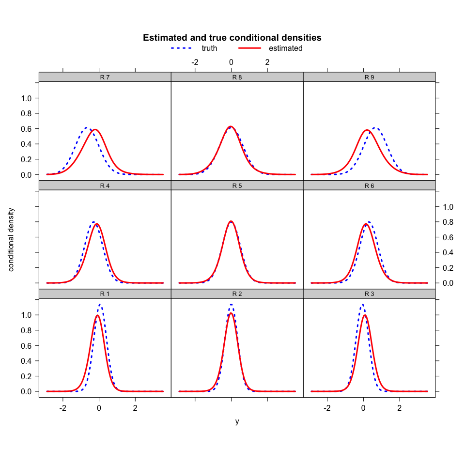

<!-- README.md is generated from README.Rmd. Please edit that file -->

# Overview

<!-- badges: start -->
<!-- badges: end -->

Conditional density estimation is a fundamental problem in statistics,
with various scientific and practical applications such as genetics and
economics. We propose a conditional density estimator based on tree
boosting and Lindsey’s method (LinCDE). LinCDE admits flexible modeling
of the density family and captures distributional characteristics like
modality and shape. In particular, LinCDE always produces smooth and
non-negative density estimates. Furthermore, in the presence of nuisance
features, LinCDE identifies the influential covariates to the response
distribution.

## Installation

You can install the development version of LinCDE from
[GitHub](https://github.com/) with:

``` r
# install.packages("devtools")
# devtools::install_github("ZijunGao/LinCDE", build_vignettes = TRUE)
```

## Example

Below is a basic example of using LinCDE for conditional mean
estimation. We generate data (*y*,*X*) where the conditional
distributions of *y* are Gaussian with different means and variances.
The conditional mean depends on *X*<sub>1</sub> and *X*<sub>2</sub>, and
the conditional variance depends on *X*<sub>2</sub>.

``` r
library(LinCDE)
# true conditional density function; LGD stands for locally Gaussian design
density.LGD = function(X, y = NULL){
  if(is.null(dim(X))){X = matrix(X, nrow = 1)}
  if(!is.null(y)){
    dens = dnorm(y, mean = (0.5 * X[, 1] + X[, 1] * X[, 2]), sd = (0.5 + 0.25 * X[, 2]))
  }else{
    y = 0.5 * X[, 1] + X[, 1] * X[, 2] + rnorm(dim(X)[1], 0, 1) * (0.5 + 0.25 * X[ ,2])
  }
}

# training data
set.seed(100)
n = 1000; d = 20
X = matrix(runif(n * d, -1, 1), ncol = d); colnames(X) = paste("X", seq(1,d), sep = "")
y.LGD = density.LGD(X)
```

We fit a LinCDE model with default hyper-parameters. Details of
hyper-parameter tuning are discussed in the vignette.

``` r
# fit a LinCDE boost model
model.example = LinCDE.boost(X = X, y = y.LGD, verbose = F)
```

We plot the estimated conditional densities from LinCDE against the true
conditional densities at 9 landmarks. LinCDE’s fit is reasonably close
to the truth.

``` r
# landmarks for visualization
XProfile = matrix(0, nrow = 3^2, ncol = d); colnames(XProfile) = paste("X", seq(1,d), sep = "")
X1 = X2 = c(-0.6,0,0.6); XProfile[, c(1,2)] = as.matrix(expand.grid(X1, X2))

# visualize LinCDE boost model's predictions at the landmarks
densityPlot(X = XProfile, trueDensity = density.LGD, model = model.example)
```



For more examples, please see the vignette :)
